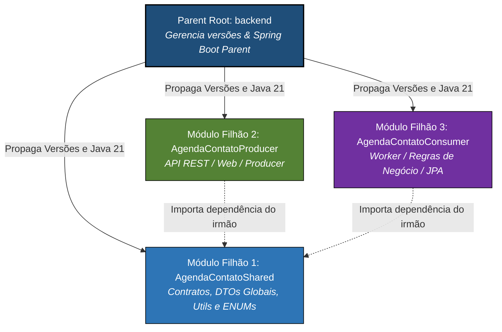

```mermaid
graph TD
    %% Estilização e Nós Principais
    Raiz[Parent Root: backend<br><i>Gerencia versões & Spring Boot Parent</i>]
    
    Shared[Módulo Filhão 1: AgendaContatoShared<br><i>Contratos, DTOs Globais, Utils e ENUMs</i>]
    Producer[Módulo Filhão 2: AgendaContatoProducer<br><i>API REST / Web / Producer</i>]
    Consumer[Módulo Filhão 3: AgendaContatoConsumer<br><i>Worker / Regras de Negócio / JPA</i>]

    %% Fluxo de Herança (Parent)
    Raiz -->|Propaga Versões e Java 21| Shared
    Raiz -->|Propaga Versões e Java 21| Producer
    Raiz -->|Propaga Versões e Java 21| Consumer

    %% Fluxo de Dependência Interna
    Producer -.->|Importa dependência do irmão| Shared
    Consumer -.->|Importa dependência do irmão| Shared

    %% Estilos Visuais
    style Raiz fill:#1f4e79,stroke:#000,stroke-width:2px,color:#fff
    style Shared fill:#2e75b6,stroke:#000,stroke-width:1px,color:#fff
    style Producer fill:#548235,stroke:#000,stroke-width:1px,color:#fff
    style Consumer fill:#7030a0,stroke:#000,stroke-width:1px,color:#fff
```

[Voltar para o início](../Organizacao_Monorepo.md)